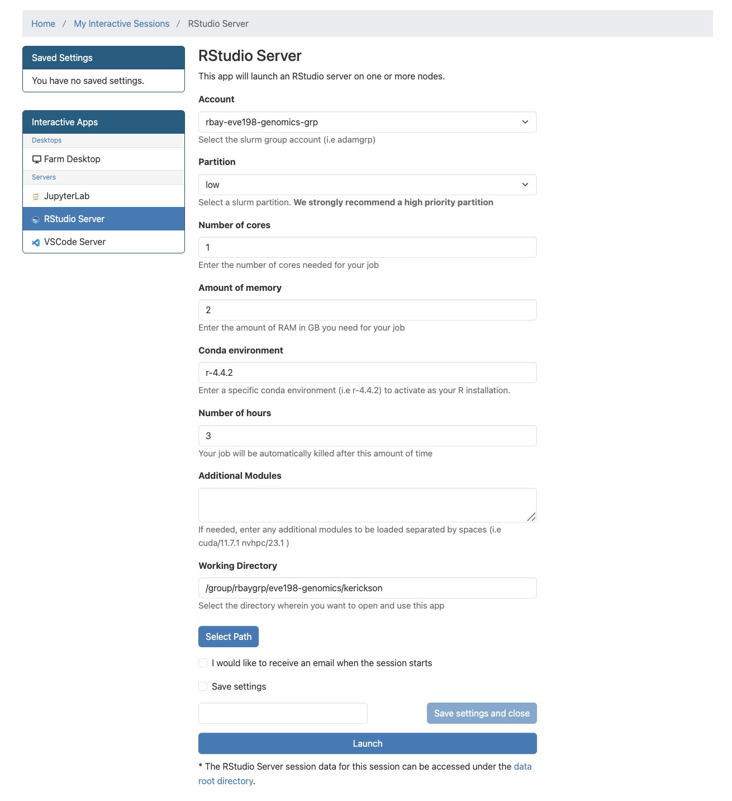

```{r setupq5, include=FALSE}
knitr::opts_chunk$set(echo = TRUE)
```

# Week 5- Finishing Variant Calling, then a pivot to R!
Picking up from last week, we will start where we left off with 
a variant calling pipeline. Then we'll pivot to interacting with the cluster in 
a new way, by starting RStudio sessions in OnDemand.

## Main Objectives

-   Organize simple commands into scripts to execute a variant calling pipeline
-   Write code in Rstudio through FarmOnDemand
-   Understand the different parts of the Rstudio window
-   Learn how to work with objects in R and general R operation

## Warmup Part 1: Comparing scripts with a friend

Buddy up! Start an OnDemand session and navigate to the script that you wrote 
for the week 4 assignment.

If either you or your partner's script did not run, take some time to look at the 
code together! Try to fix any errors and get it to run. If you're having 
trouble diagnosing your issues, remember that you can look at your log files, which
have the extensions `.err` and `/out`. 

If both of your code produced the expected files, compare scripts! Find any places 
where your code differs, and discuss why you chose to code it the way you did!
After seeing your partner's script, are there any changes you'd like to make to yours?

## Warmup Part 2: Ensuring we have well organized data!
Last week's assignment was to rerun the `fastqc` and `cutadapt` commands that 
we learned last week to create a well organized file system. If your script 
didn't work exactly as you planned, let's make sure that we 
all are moving forward into the next section with the same files.

From within your `week4` folder, you should make sure you have a folder called 
`raw_data` which contains the following files:

``` html
$ ls raw_data
Ppar_tinygenome.fna.gz	  SRR6805881.tiny.fastq.gz  SRR6805883.tiny.fastq.gz  SRR6805885.tiny.fastq.gz
SRR6805880.tiny.fastq.gz  SRR6805882.tiny.fastq.gz  SRR6805884.tiny.fastq.gz
```

From within your `week4` folder, you should make sure you have a folder called 
`trimmed_fastqs` which contains the following files:

``` html
$ ls trimmed_fastqs
SRR6805880.tiny_trimmed.fastq.gz  SRR6805882.tiny_trimmed.fastq.gz  SRR6805884.tiny_trimmed.fastq.gz
SRR6805881.tiny_trimmed.fastq.gz  SRR6805883.tiny_trimmed.fastq.gz  SRR6805885.tiny_trimmed.fastq.gz
```

You may have some additional files inside your folder, like fastqc files, your 
week 4 scripts or slurm outputs, those can all stay there!

If you are struggling to get the files into the right folder, you can copy this folder 
into your personal `week4` folder from the folder `week4_files` as follows:
``` html
$ cd /group/rbaygroup/eve198-genomics/yourdirectory/week4
$ cp -r /group/rbaygroup/eve198-genomics/week4_files/raw_data ./
$ cp -r /group/rbaygroup/eve198-genomics/week4_files/trimmed_fastqs ./
```

Rerun the `ls` commands to ensure that you have everything you need in the 
`raw_data` and `trimmed_fastqs`. Now we can move forward with the next steps in 
the variant calling pipeline!

## Step 3: Building an index of our genome
Recall that we've already performed QC and adapter cutting on our sequencing reads.
Today, we'll pick up where we left off with our variant calling pipeline:


Recall that we need to reload packages every time we open a new OnDemand session. This week
we'll need:

-   samtools: allows us to filter and view our mapped data
-   bowtie2: to map our reads to the reference genome
-   angsd: used to find variants in our data

Load all these packages using `module load`.

Our next task is to index our genome. We'll do that with the bowtie2-build
command. This will generate a lot of files that describe different
aspects of our genome

We give bowtie2-build two things, the name of our genome, and a general
name to label the output files. I always keep the name of the output
files the same as the original genome file (without the .fna.gz
extension) to avoid confusion.

``` html
bowtie2-build raw_data/Ppar_tinygenome.fna.gz raw_data/Ppar_tinygenome
```

This should produce several output files with extensions including: .bt2
and rev.1.bt2 etc (six files in total)

## Step 4: Map reads to the genome
Now that we've indexed our reference, we can map our sequencing reads to that
reference genome. 
Let's map those reads using a for loop.

First, let's set up a directory for the output files, which will have the extension
`.sam` (more on that later!)

``` html
$ mkdir sams
```

``` html
for filename in trimmed_fastqs/*.tiny_trimmed.fastq.gz
do

  base=$(basename $filename .tiny_trimmed.fastq.gz)
  echo ${base}

  bowtie2 -x raw_data/Ppar_tinygenome -U trimmed_fastqs/${base}.tiny_trimmed.fastq.gz -S sams/${base}.sam

done
```

You should see a bunch of text telling you all about how well our reads
mapped to the genome. For this example we're getting a low percentage
(~20%) because of how the genome and reads were subset for this
exercise.

You'll also notice that we have made a bunch of .sam files. THis stands
for Sequence Alignment Map file. Let's use `less` to look at one of
these files using `less`

## Step 5: sam to bam file conversion

The next step is to convert our sam file to a bam (Binary Alignment Map
file). This gets our file ready to be read by angsd the program we're
going to use to call SNPs.

``` html
mkdir bams
for filename in sams/*.sam
do

  base=$(basename $filename .sam)
  echo ${base}
  
  samtools view -bhS sams/${base}.sam | samtools sort -o bams/${base}.bam

done
```

## Step 6: Genotype likelihoods

There are many ways and many programs that call genotypes. The program
that we will use calculates genotype likelihoods, which account for
uncertainty due to sequencing errors and/or mapping errors and is one of
several programs in the package ANGSD. The purpose of this class is not
to discuss which program is the "best", but to teach you to use some
commonly used programs.

angsd needs a text file with the `.bam` file names listed. We can make
that by running the command below

``` html
ls bams/*.bam > bam.filelist
```

Look at the list:

``` html
cat bam.filelist
```

Run the following code to calculate genotype likelihoods

``` html
angsd -bam bam.filelist -GL 1 -out genotype_likelihoods -doMaf 2 -SNP_pval 1e-2 -doMajorMinor 1
```

The output of angsd gives us a nice overview of what happened:
``` html
	-> Output filenames:
		->"genotype_likelihoods.arg"
		->"genotype_likelihoods.mafs.gz"
	-> Tue Feb  3 22:27:17 2026
	-> Arguments and parameters for all analysis are located in .arg file
	-> Total number of sites analyzed: 71450
	-> Number of sites retained after filtering: 9 
	[ALL done] cpu-time used =  1.39 sec
	[ALL done] walltime used =  1.00 sec
```

We can see that it generated two files, one with a .arg extension (which has a
record of the script we ran to generate the output), and a .maf file (that
will give you the minor allele frequencies and is the main output file).
We can also see that we started with 71,450 sites but only retained 9 after 
filtering. 

To see what the other parameters do you can run the following:

``` html
angsd -h
```
We can change the parameters of the angsd genotype likelihoods command
by altering the values next to `-SNP_pval`. If we remove the `-SNP_pval`
command entirely we get around 70,000 sites retained! Wow! That seems like a
lot given our \~20% mapping rate. If you instead increase the p-value
threshold to 1e-3 we find 3 SNPs.


> ## Class Exercise 1: Changing angsd parameters
>
> To see what the parameters you can use with angsd, type `angsd -h`
> Try changing the value of `-SNP_pval` and rerunning angsd.
> How many sites are retained if we remove the `-SNP_pval` flag entirely?
> How many sites are retained if you instead increase the p-value
> threshold to 1e-3?


## Orientation to R
There are many R packages that are built to work with SNP data! So often, once 
we use slurm scripts to pare down our data from sequencing reads to SNPs, we read 
the SNP data into R to analyze it from there! Before we get to working with SNP 
data, we'll start with a more general intro to R. 

This lesson is modified from materials compiled by Serena Caplins from
the STEMinist_R lessons produced by several UC Davis graduate student
and which can be found
[here](https://github.com/ecalfee/STEMinist_R.git).

First let's navigate to our R studio on Farm OnDemand! Launch your
session with the information shown below: 
Give yourself 2 for memory and make sure your conda environment is set to `r-4.4.2`



After we start it up we will want to create a new file called
"Week5-IntroR.R" to type our scripts for today.

To do this, we will click `File`, `New File` then `R script`. Name your
file with your `name-Week5-introR`

`#` before a sentence comments out what you want before you write code.
Without a `#` R will think what you are writing needs to be run as a
command! I have used comments in this example to write what the script is for. The top left is the script, the bottom left is the terminal window where code and outputs will be typed, the top right is your environment 

R can be used for basic arithmetic. Type this into your script and hit
enter:

```{r , echo=T}
#adding prompt
5+10+23

```

It can also store values in variables:

You can assign an object using an assignment operator `<-` or `=`.

```{r , echo=T}
#storing variables
number<-10

numbers<-c(10, 11, 12, 14, 16)
```

You can see your assigned object by typing the name you gave it.

```{r , echo=T}
#assigned objects
number

numbers

```

Objects can be numbers or characters:

```{r , echo=T}
#objects as characters
cat<-"meow"
dog<-"woof"


```

We can use colons to get sequences of numbers:

```{r , echo=T}
#sequence of numbers
n<-1:100

```

Data Structures include:

1.  Vector

2.  Lists

3.  Matrices

4.  Factor

5.  Data frame

Vectors can also include characters (in quotes): `c()`=concatenate, aka
link things together!

```{r , echo=T}
#link things together with this code
animals<-c("woof", "meow", "hiss", "baa")

```

## Manipulating a vector object

We can get summaries of vectors with `summary()`

```{r , echo=T}
#summarize what you have done so far
summary(n)

```

We can see how long a vector is with `length()`

```{r , echo=T}
#how long is vector n
length(n)

```

You can use square brackets `[]` to get parts of vectors.

```{r , echo=T}

#what is the 50th entry in our vector n?
n[50]

```

> ## Class Exercise 2
> 1) What is the 2nd entry in our vector animals?
> 
> create a new vector with the following code for different field sites to answer questions 2 & 3:  
```{r, echo=T}
site_code <- c("BB","ShC","BH","Pes","StC","MR","PV","KH","CM","RP","Car","SR","RM","Dav","JB","Mal","PB","PA","Leu","VD","A")
```
> > 2) Without counting, which site is the 10th entry?
> > 3)  How many sites are there total?


## Operations act on each element of a vector

```{r , echo=T}

# +2
numbers+2

# *2
numbers*2

# mean
mean(numbers)

# ^2
numbers^2

# sum
sum(numbers)

```

## Operations can also work with two vectors

```{r , echo=T}

#define a new object y
y<-numbers*2

# n + y
numbers + y

# n * y
numbers * y

```

## A few tips below for working with objects

We can keep track of what objects R is using, with the functions `ls()`
and `objects()`

```{r , echo=T}
ls()
objects() #returns the same results as ls() in this case. because we only have objects in our environment.
```

This is where those objects show up with you type `ls()`: 

```{r, echo=T}
# how to get help for a function; you can also write help()
?ls

# you can get rid of objects you don't want

rm(numbers)

# and make sure it got rid of them
ls()

```


Call the help files for the functions ls() and rm() + What are the
arguments for the ls() function? + What does the 'sorted' argument do?

From the help file: sorted is a logical indicating if the resulting
character should be sorted alphabetically. Note that this is part of
ls() may take most of the time.

## Characterizing a dataframe

We'll now move from working with objects and vectors to working with
dataframes:

-   Here are a few useful functions! I will go over each as we introduce
    them throughout the lesson today:
    -   install.packages()
    -   library()
    -   data()
    -   str()
    -   dim()
    -   colnames() and rownames()
    -   class()
    -   as.factor()
    -   as.numeric()
    -   unique()
    -   t()
    -   max(), min(), mean() and summary()

We're going to use data on sleep patterns in mammals. This requires
installing a package (ggplot2) and loading the data

Install the package `ggplot2`. This only has to be done once and after
installation we should then **comment out the command to install the
package with a #.**

```{r, echo=T}

#install.packages("ggplot2")

#load the package

library (ggplot2)
```

Load the data (it's called msleep). This dataset includes information
bout mammal sleep times and weights that was taken from a study by V. M.
Savage and G. B. West. "A quantitative, theoretical framework for
understanding mammalian sleep. Proceedings of the National Academy of
Sciences, 104 (3):1051-1056, 2007."

The data includes 
    -   `name` (common name)
    -   `genus`
    -   `vore` (carnivore, omnivore, etc)
    -   `order`
    -   `conservation` (status)
    -   `sleep_total` (total amount of sleep in hours)
    -   `sleep_rem` (rem sleep in hours)
    -   `sleep_cycle` (length of sleep cycle, in hours)
    -   `awake` (amount of time spent awake, in hours)
    -   `brainwt` (brain weight in kilograms) 
    -   `bodywt` (body weight in kilograms)

```{r, echo=T}

data("msleep")
```

There are many functions in R that allow us to get an idea of what the
data looks like. For example, what are it's dimensions (how many rows
and columns)?

```{r, echo=T}

# head() -look at the beginning of the data file
# tail() -look at the end of the data file

head(msleep)
tail(msleep)

# str()
str(msleep)
```

dim(), ncol(), nrow()- dimensions, number of columns, number of rows
colnames(), rownames() - column names, row names

Rstudio also allows us to just look into the data file with `View()`.
Try to look at the msleep data using `View(msleep)`

## How to access parts of the data

We can also look at a single column at a time. There are three ways to
access this: \$, [,#] or [,"a"].

Think about "**R**emote **C**ontrol car" to remember that [5,] means
fifth row and [,5] means fifth column! Rows are listed first and columns
are listed second.

Each way has it's own advantages! The first subsets the third column of
data, so you need to know where your data of interest is. The second
subsets the `vore` column only. The third prints all of the data from
the `vore` column in your console window.

```{r, echo=T}

msleep[,3]
msleep[, "vore"]
msleep$vore

```

If you wanted to save these as objects, you need to add an arrow an a
new name for that object.  They should all be the same!

```{r, echo=T}

column3<-msleep[,3]
voreonly<-msleep[, "vore"]
vores<-msleep$vore

head(column3) #do this or View() for all of your new objects!
```

It's important to know the class of data if you want to manipulate it.
For example, you can't add characters. `msleep` contains several
different types of data. We see with `str()` that there are columns of
data that are characters and numeric.

Data Types/Classes:

-   Character (names)

-   Numeric (numbers)

-   Logical (T/F)

-   Integer (2L for example)

-   Complex (imaginary #s)

-   Raw (not really used)


```{r, echo=T}

class(msleep$vore) #character!

class(msleep$sleep_total) #numeric!
```

We can also look at a single row at a time. There are two ways to access this: 

- by indicating the row number in square brackets next to the
name of the dataframe `name[#,]`
- by calling the actual name of the row (if your rows have names) `name["a",]`.

```{r, echo=T}

msleep[43,]
msleep[msleep$name == "Mountain beaver",]

```


<https://www.nps.gov/articles/000/mapping-mountain-beavers-in-point-reyes-a-collaboration-between-the-national-park-service-and-uc-berkeley.htm>

We can select more than one row or column at a time:

```{r, echo=T}
 # see two columns

msleep[,c(1, 6)]

 # and make a new data frame from these subsets

subsleep<-msleep[,c(1, 6)]

```

But what if we actually care about how many **unique** things are in a
column?

```{r, echo=T}
 # unique()
unique(msleep[, "order"])

 # table()
table(msleep$order)

 # levels(), if class is factor (and if not we can make it a factor) showing the way that the data is displayed
levels(as.factor(msleep$order))

```


## Group Work Activity: practice exploring a dataframe


We'll use the built-in 'iris' dataset. The command: `
```{r, echo=T}
data(iris) # this loads the 'iris' dataset. 
```
You can view more information about this dataset with `help(iris)` or `?iris`.
This dataset was published by Ronald Fisher in his 1936 paper: "The use of multiple
measurements in taxonomic problems". It has three plant species (setosa,
virginica, versicolor) and four morphological traits measured for each
sample in centimeters: Sepal.Length, Sepal.Width, Petal.Length and
Petal.Width. It is important to acknowledge that the field of genetics has been 
built on eugenics, and Fisher was a prominent geneticist and eugenicist. 
More information about this can be accessed here: <https://www.ucl.ac.uk/biosciences/gee/ucl-centre-computational-biology/ronald-aylmer-fisher-1890-1962>

Submit a screenshot or copied text that shows the code you ran to answer 
the following questions:

> -  1)  How many rows are in the dataset? 

> -  2)  How many species of flowers are in the dataset? 

> -  3)  How many columns does this data frame have? What are their names?

> -  4)  What class did R assign to each column?

> -  5)  Create a vector that is the area of each flower's petals. (You can assume 
>     that each petal is rectangular so that petal width * petal length = petal area) 

> -  6)  What is the maximum sepal length of the irises? 

## Key Points

-   Useful functions such as `install.packages()`, `library()` can help
    us upload packages and data from R, while other functions such as
    `str()`, `dim()`, and `unique()` can help us investigate dataframes
-   To look at our data we can use several commands, including `view()`
    or `data$columnofinterest` if you only want to look at one variable.
-   Manipulating data in R can be extremely helpful in the analysis
    stage, and we can get data on `mean()`, `min()`, `max()`, and
    `summary()` data on different variables of interest

<details>

<summary>[Class Exercise Solution]{style="color: orange;"}</summary>

<p>

> > ## Class Exercise 1: Solution
> > no pvalue: 68574 sites retained
> > p = 1e-3: 0 sites retained

> > ## Class Exercise 2: Solution
> > 1) animals[2] 
> > "meow"
> > 2) site_code[10] 
> > "RP"
> > 3) summary(site_code)
> > 21 sample sites

</p>

</details>
